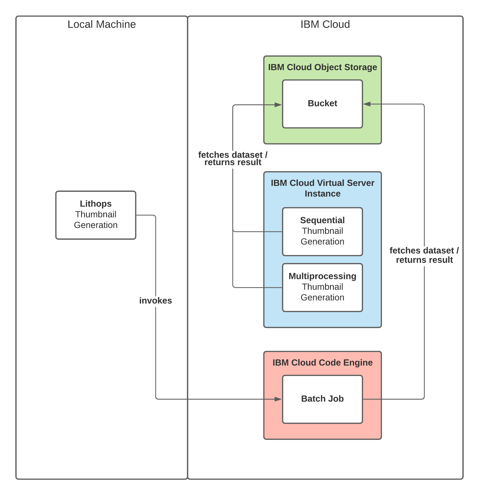
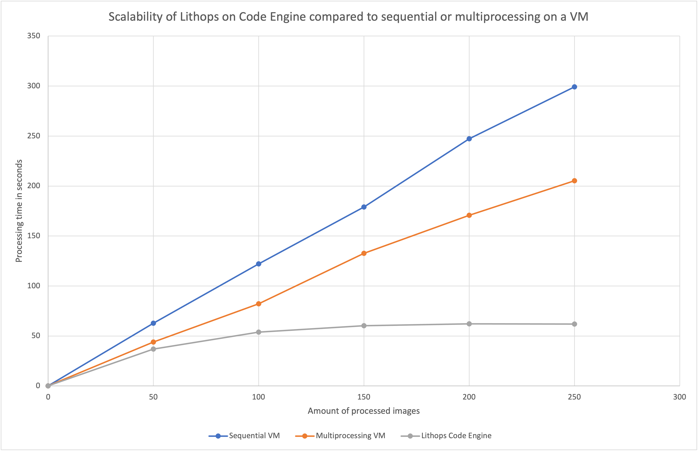
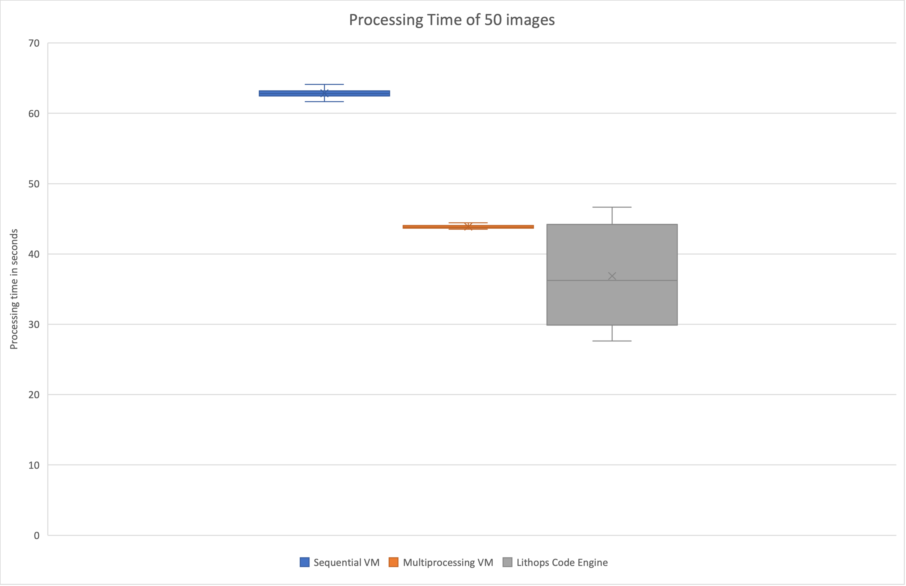
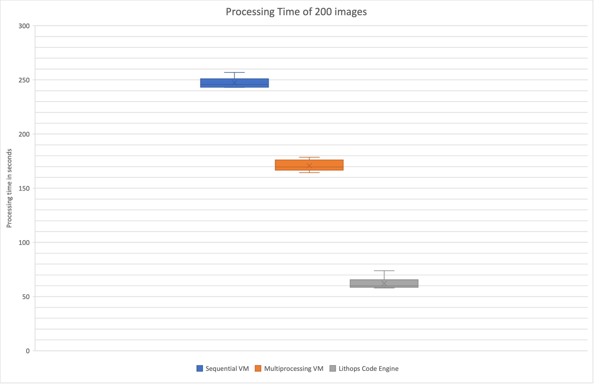

# Repository for Research Paper: Serverless Thumbnail Generation
Serverless deployment on Cloud Code Engine that uses the Lithops Framework to process images in parallel

**English Title:** Juxtaposition of thumbnail generation on IBM Cloud Code Engine with multiprocessing through the Lithops Framework and the traditional deployment on a virtual machine

**German Title:** Gegenüberstellung eines serverless Batch Jobs basierend auf dem Lithops Framework zur parallelen Generierung von Thumbnails auf IBM Cloud Code Engine und der Bereitstellung auf einem Virtual Server im Hinblick auf Performance, Skalierbarkeit und Kosten

(susceptible to change)

### This repository contains:
- The code for the thumbnail generator as used for the research paper
  - `server_thumbnails_sequential.py` (Sequentially generate thumbnails on local machine)
  - `server_thumbnails_multi.py` (Use the standard python multiprocessing library to generate thumbnails in parallel on local machine)
  - `serverless_thumbnails.py` (Uses Lithops to create a Batch Job that will spawn one worker per image to be processed. Benefits from principle of unlimited capacity in the cloud)
- Documentation including charts and architecture
- The dataset of images I used for the research paper
- Logs&Stats of all the experiments I conducted for transparency

### Recreating the results from the research paper:
- Closely follow the following steps to set everything up
- Run `server_thumbnails_sequential.py` and `server_thumbnails_multi.py` on a virtual machine with the specs:
  - 2 vCPU
  - 8 GiB Memory
  - 4 Gbps Network-Bandwidth
- Even when following the instructions the results might vary from the ones in the paper because of:
  - Your used images (My dataset of images is in the `/dataset` directory)
  - Varying response time of IBM Cloud COS, IBM Cloud Code Engine
  - OS-specific configuration of the virtual machine

**RUNNING MY SCRIPT WILL CREATE COSTS** due to high bandwidth usage of COS and usage of Code Engine or a Virtual Server

## Running the Thumbnail Generator

### Setting up requirements
- Create an IBM Cloud IAM Key [here](https://cloud.ibm.com/iam/apikeys)
- Create an IBM Cloud [COS Bucket](https://cloud.ibm.com/objectstorage/create) and store all images to be processed in a directory called `images`
- Create an IBM Cloud [Code Engine Namespace](https://cloud.ibm.com/codeengine/create/start)
- Add these keys with your values to the `.lithops_config`:

```
lithops:
    storage: ibm_cos
    storage_bucket: <YOUR BUCKET NAME>
    backend: code_engine
    mode: serverless
    
ibm:
    iam_api_key: <IAM_API_KEY>
   
code_engine:
    namespace: <NAMESPACE>
    region: <REGION>
    runtime: ibmfunctions/lithops-ce-v385:235
```
For more info, have a look [here](https://lithops-cloud.github.io/docs/source/compute_config/code_engine.html)


### Sequential Thumbnail Generation

1. Run `server_thumbnails_sequential.py`
2. The script will read the available images in the bucket
3. Specify the number of images to be turned into thumbnails in the console
4. The script will generate the thumbnails and will save them to the `/thumbnails` directory in your bucket root

### Multiprocessing Thumbnail Generation

1. Run `server_thumbnails_multi.py`
2. The script will read the available images in the bucket
3. Specify the number of images to be turned into thumbnails in the console
4. The script will generate the thumbnails and will save them to the `/thumbnails` directory in your bucket root

### Serverless Thumbnail Generation (Lithops)

1. Run `serverless_thumbnails.py`
2. The script will read the available images in the bucket
3. Specify the number of images to be turned into thumbnails in the console
4. The script will generate the thumbnails and will save them to the `/thumbnails` directory in your bucket root

## Architecture

### Thumbnail Generator System Context


### Thumbnail Generator Architecture


## Results







## Dataset images

All images are taken from [Unsplash](https://unsplash.com/) and do not require attribution.
To find the author of each image, add the image name to the following url: [https://unsplash.com/photos/](https://unsplash.com/photos/)

